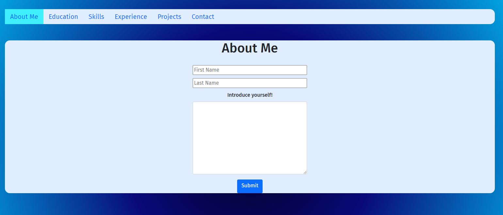

# React_Porfolio_Generator

[Github](https://github.com/mwallis5110/React_Portfolio_Generator)  

## Screen Shots

##### Table of Contents  
[Purpose](#purpose)  
[Features](#features)  
[Technologies Used](#technologies-used)  
[Installation](#installation)  
[Usage](#usage)  
[Credits](#credits)  
[License](#license)  

## Purpose  

Outside of the tech world, building a solid and quality portfolio can be an extremely daunting and even difficult task. The goal of this project was to give non-programmers the ability to show off their work.

## Features 
Upon creating an account, users can log in and follow the series of prompts to generate their own project portfolio. Once generated, the user is provided a link to their portfolio that they can share with other people, much like a url or a website.

## Technologies-Used  
This project was made possible with React, GraphQL, Apollo-Server, Bootstrap, & JSX.  

## Installation  
There is no need to install this application for use, because it is hosted at the links provided above. However, for code inspection or etc, if you have SSH Keys linked, you can simple use your terminal and clone the repo down, otherwise, the typical zip.

## Usage  
To use, simply create an account as prompted whenever you start. After this, you are taken to a page where, presumably, you have no prior portfolios designed. Click the button to begin. Then, fill out the desired boxes however you want with respect to the criteria they pertain to, for example; under Name you would put your name and once finished, submit that section before proceeding. Once every tab has been filled out, you click generate portfolio and the application will create one for you.

## Credits

This project was made possible thanks to the following people
[Mason Wallis](https://github.com/mwallis5110)

[Joris Powathil](https://github.com/jorropowathil)

[Carlos Perez](https://github.com/cperezba)

[Marie Valdovinos](https://github.com/mevaldovi)

[Evan Ebert](https://github.com/evan-ebert17)

## License

Copyright 2021 Mason Wallis. Joris Powathill, Carlos Perez, Marie Valdovinos, Evan Ebert

Permission is hereby granted, free of charge, to any person obtaining a copy of this software and associated documentation files (the "Software"), to deal in the Software without restriction, including without limitation the rights to use, copy, modify, merge, publish, distribute, sublicense, and/or sell copies of the Software, and to permit persons to whom the Software is furnished to do so, subject to the following conditions:

The above copyright notice and this permission notice shall be included in all copies or substantial portions of the Software.

THE SOFTWARE IS PROVIDED "AS IS", WITHOUT WARRANTY OF ANY KIND, EXPRESS OR IMPLIED, INCLUDING BUT NOT LIMITED TO THE WARRANTIES OF MERCHANTABILITY, FITNESS FOR A PARTICULAR PURPOSE AND NONINFRINGEMENT. IN NO EVENT SHALL THE AUTHORS OR COPYRIGHT HOLDERS BE LIABLE FOR ANY CLAIM, DAMAGES OR OTHER LIABILITY, WHETHER IN AN ACTION OF CONTRACT, TORT OR OTHERWISE, ARISING FROM, OUT OF OR IN CONNECTION WITH THE SOFTWARE OR THE USE OR OTHER DEALINGS IN THE SOFTWARE.
